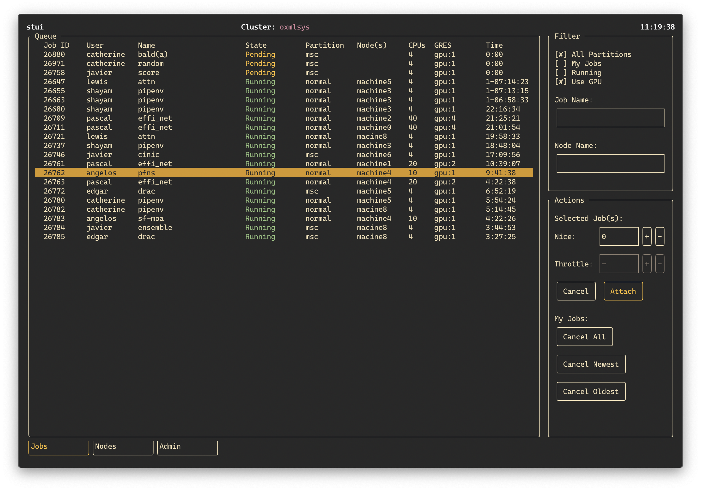

[](https://github.com/psf/black)
[](https://opensource.org/licenses/MIT)
[](https://twitter.com/notmilad)

# stui
A Slurm dashboard for the terminal.



## Features
* Connect to local Slurm cluster or remote clusters via SSH
* Quickly filter jobs based on commonly-used criteria
* Cancel, attach to, or modify properties of selected jobs.

## Installation

```shell
$ pip install stui
```

## Usage

On a machine that's part of a Slurm cluster simply fire up `stui`:

```shell
$ stui
```

To connect to a remote Slurm cluster via SSH:

```shell
$ stui --remote REMOTE_MACHINE
```

`REMOTE_MACHINE` format is `USER@SERVER_ADDR` or simply the `Host` name specified in the SSH config file.

N.B. there's currently no support for authenticating SSH connections with passwords. SSH keys must have been exchanged for the remote functionality to work.
